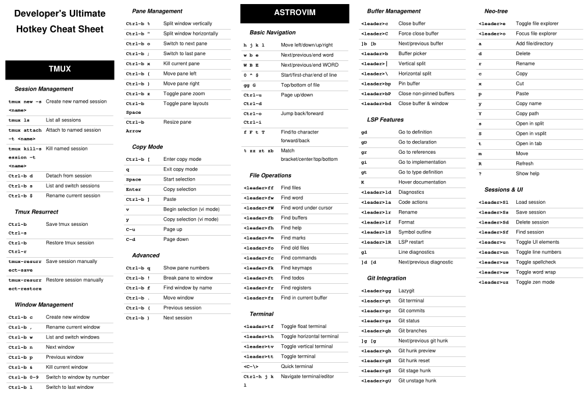

# Cheat Sheet Generator

A tool to generate optimized cheat sheets from YAML hotkey definitions, designed for A4 paper printing in black and white.

## Features

- Parse hotkey definitions from YAML files
- Generate optimized PDF cheat sheets for A4 printing
- Support for sections and subsections
- Configurable layout (columns, font size, margins)
- Black and white printing optimized
- Multi-page support for large cheat sheets
- Command-line interface with validation



`.pdf` version of image above is in the repo (`hotkeys.pdf`)

## Installation

### Option 1: Install from source

This project uses Poetry for dependency management. Install dependencies:

```bash
poetry install
```

### Option 2: Download pre-built executable

Download the latest executable for your platform from the releases page.

### Option 3: Build your own executable

```bash
# Install dependencies including PyInstaller
poetry install
poetry add --group dev pyinstaller

# Build executable
python build_executable.py
```

The executable will be created in the `dist/` directory.

## Usage

### Basic Usage

Generate a cheat sheet from a YAML file:

```bash
poetry run cheatsheet-gen hotkeys.yaml
```

This will create `hotkeys.pdf` in the same directory.

### Command Line Options

```bash
poetry run cheatsheet-gen [OPTIONS] YAML_FILE

Options:
  -o, --output PATH       Output PDF file path
  -v, --validate         Only validate the YAML file
  -e, --estimate-pages   Estimate number of pages and exit
  --help                 Show this message and exit
```

### Examples

```bash
# Generate PDF with custom output path
poetry run cheatsheet-gen hotkeys.yaml -o my_cheatsheet.pdf

# Validate YAML file without generating PDF
poetry run cheatsheet-gen hotkeys.yaml --validate

# Estimate how many pages the cheat sheet will have
poetry run cheatsheet-gen hotkeys.yaml --estimate-pages
```

## YAML Format

The YAML file should follow this structure:

```yaml
title: "Your Cheat Sheet Title"

config:
  font_size: 8           # Base font size
  header_font_size: 11   # Header font size
  columns: 3             # Number of columns
  row_height: 12         # Height per hotkey row
  margin: 30             # Page margins in points

sections:
  Section Name:
    Subsection Name:
      "hotkey": "description"
      "another-key": "what it does"

    # Direct hotkeys under section (no subsection)
    "direct-key": "direct description"

  Another Section:
    "key": "description"
```

### Example YAML Structure

```yaml
title: "Vim Cheat Sheet"

sections:
  Movement:
    Basic:
      "h j k l": "Left/down/up/right"
      "w b": "Next/previous word"

    "gg G": "First/last line"

  Editing:
    "i a": "Insert before/after cursor"
    "o O": "New line below/above"
```

## Configuration Options

- `font_size`: Base font size for hotkey descriptions (default: 9)
- `header_font_size`: Font size for section headers (default: 12)
- `columns`: Number of columns per page (default: 3)
- `row_height`: Height per hotkey row in points (default: 14)
- `margin`: Page margins in points (default: 36)
- `section_spacing`: Space between sections (default: 10)
- `subsection_spacing`: Space between subsections (default: 6)

## Sample Hotkeys Included

The included `hotkeys.yaml` file contains comprehensive hotkey references for:

- **Tmux**: Session, window, and pane management
- **AstroVim**: Navigation, file operations, LSP features, Neo-tree
- **Git**: Basic commands, branching, history, stashing
- **Windows**: Window management, virtual desktops, file explorer
- **Linux Terminal**: Navigation, file operations, text processing
- **Vim Motions**: Movement, text objects, editing commands

## Development

### Setup Pre-commit Hooks

```bash
poetry install
poetry run pre-commit install
```

### Running Tests

```bash
poetry run pytest
```

### Running Tests with Coverage

```bash
poetry run pytest --cov=src/cheatsheet_generator --cov-report=html
```

### Code Formatting and Linting

The project uses pre-commit hooks to automatically format and lint code:

```bash
# Format code
poetry run black src tests

# Sort imports
poetry run isort src tests

# Lint code
poetry run flake8 src tests

# Or run all checks
poetry run pre-commit run --all-files
```

### Building Executables

Build a standalone executable for your platform:

```bash
python build_executable.py
```

### CI/CD

The project includes GitHub Actions workflows that:
- Run tests on every push and PR
- Build executables for Linux, Windows, and macOS
- Create releases with executables when tags are pushed

## Project Structure

```
cheatsheet_generator/
├── src/cheatsheet_generator/
│   ├── __init__.py
│   ├── models.py          # Data models
│   ├── parser.py          # YAML parser
│   ├── generator.py       # PDF generator
│   └── cli.py            # Command line interface
├── tests/
│   ├── test_models.py
│   ├── test_parser.py
│   ├── test_generator.py
│   └── test_cli.py
├── hotkeys.yaml          # Sample hotkey definitions
├── pyproject.toml        # Poetry configuration
└── README.md
```

## Dependencies

- **PyYAML**: YAML parsing
- **ReportLab**: PDF generation
- **Click**: Command line interface
- **Pillow**: Image processing support

## Testing

The project includes comprehensive test coverage for:

- Data models validation
- YAML parsing and validation
- PDF generation functionality
- Command line interface
- Error handling and edge cases

## License

This project is open source. Feel free to use, modify, and distribute.
